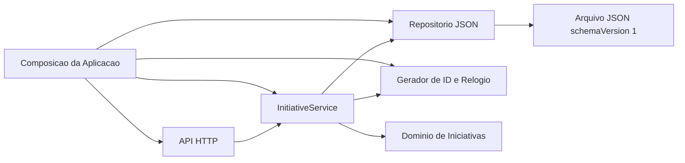
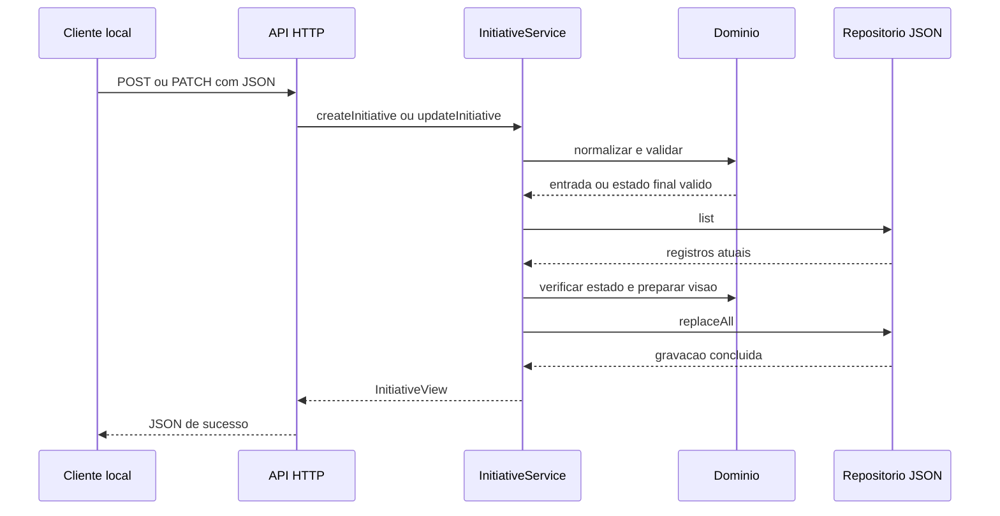
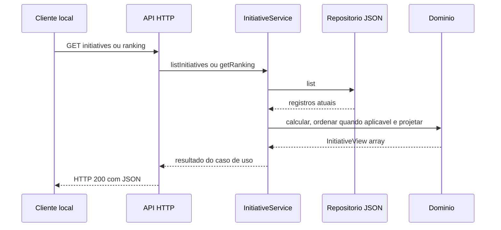

# Dependencias e Fluxos entre Componentes

## Direcao das dependencias

### Alternativa textual

1. A Composicao da Aplicacao cria API HTTP, `InitiativeService`, Repositorio JSON, gerador de ID e relogio.
2. A API HTTP chama somente o `InitiativeService` para capacidades de negocio.
3. O `InitiativeService` usa o Dominio, o contrato do Repositorio e os colaboradores injetados.
4. O Repositorio JSON e o unico componente que acessa o arquivo com `schemaVersion: 1`.
5. O Dominio nao depende de HTTP, servico, repositorio ou arquivo.

## Matriz de dependencias

Legenda: `D` indica dependencia direta; `I` indica dependencia fornecida por injecao; `-` indica ausencia de dependencia.

| Consumidor / Dependencia | Composicao | API HTTP | InitiativeService | Dominio | Repositorio | ID e Relogio | Arquivo JSON |
|---|---:|---:|---:|---:|---:|---:|---:|
| Composicao | - | D | D | - | D | D | - |
| API HTTP | - | - | I | - | - | - | - |
| InitiativeService | - | - | - | D | I | I | - |
| Dominio | - | - | - | - | - | - | - |
| Repositorio JSON | - | - | - | - | - | - | D |

## Padroes de comunicacao

| Origem | Destino | Padrao | Dados |
|---|---|---|---|
| Cliente local | API HTTP | Requisicao e resposta HTTP JSON | Metodo, caminho, identificador e corpo |
| API HTTP | InitiativeService | Chamada assincrona em processo | Entrada interpretada e identificador |
| InitiativeService | Dominio | Chamada sincrona de funcao pura | Iniciativas, entradas e patches |
| InitiativeService | Repositorio | Chamada assincrona por interface injetada | Colecao de registros completos |
| InitiativeService | ID e Relogio | Chamada sincrona por interface injetada | Nenhum dado de negocio na entrada |
| Repositorio | Arquivo JSON | Entrada e saida assincrona local | Documento versionado completo |

Nao existem eventos, filas, chamadas remotas, estado global compartilhado ou comunicacao entre unidades.

## Fluxo de escrita

### Alternativa textual do fluxo de escrita

O cliente envia `POST` ou `PATCH`; a API interpreta o JSON e chama o servico; o servico usa o dominio para validar, consulta o estado atual, prepara o estado final e solicita uma unica substituicao ao repositorio; somente depois da gravacao a resposta de sucesso retorna ao cliente. Qualquer falha anterior a `replaceAll` encerra o fluxo sem gravacao.

## Fluxo de leitura e ranking

### Alternativa textual do fluxo de leitura

A API encaminha a consulta ao servico, que le os registros pelo repositorio. O dominio calcula as pontuacoes e, somente para ranking, ordena com precisao completa antes de arredondar a exibicao. O resultado retorna pelo servico e e serializado pela API HTTP.

## Fluxo de erro esperado

1. O componente que reconhece a falha cria um `ApplicationError` com codigo estavel.
2. O erro atravessa o `InitiativeService` sem ser convertido em status HTTP.
3. A API HTTP mapeia o codigo para status e corpo JSON.
4. Campos internos, stack trace e caminhos locais ficam fora da resposta.
5. Nenhuma resposta de sucesso e enviada antes de uma escrita terminar.

## Regras de acoplamento

- A API HTTP nao importa o repositorio nem funcoes de dominio para executar casos de uso.
- O repositorio nao conhece o modelo de resposta, a pontuacao RICE ou codigos HTTP.
- O dominio recebe dados simples e devolve dados ou erros de aplicacao, sem efeitos colaterais.
- Dependencias substituiveis entram pelas fabricas; modulos consumidores nao importam instancias compartilhadas.
- A composicao pode conhecer implementacoes concretas, mas nao contem regras de negocio.

## Validacao dos diagramas

- Os identificadores Mermaid usam somente letras ASCII.
- Todas as conexoes referenciam participantes ou nos declarados.
- Rotulos com espacos e caracteres especiais estao delimitados.
- Cada diagrama possui uma alternativa textual equivalente.

## Conformidade das extensoes

- **Resiliency Baseline**: N/A; extensao desabilitada na Analise de Requisitos.
- **Security Baseline**: N/A; extensao desabilitada na Analise de Requisitos.
- **Property-Based Testing**: N/A; extensao desabilitada na Analise de Requisitos.
