# Plano de Execucao

## Resumo da analise detalhada

### Escopo

- **Tipo de projeto**: greenfield local, com uma unica unidade de trabalho.
- **Objetivo principal**: implementar uma API Node.js para cadastro, atualizacao, listagem e priorizacao deterministica de iniciativas pelo metodo RICE.
- **Componentes previstos**: camada HTTP, regras de dominio RICE, validacao, persistencia em arquivo JSON e testes automatizados.
- **Restricoes principais**: Node.js 22 ou superior, ECMAScript Modules, somente modulos nativos, sem nuvem, banco de dados, conteiner ou interface grafica.

### Avaliacao de impacto

| Area | Impacto | Analise |
|---|---|---|
| Experiencia do usuario | Sim | Duas personas consumirao resultados observaveis pelos cinco endpoints locais. |
| Estrutura da aplicacao | Sim | O projeto criara componentes separados para HTTP, dominio e persistencia. |
| Modelo de dados | Sim | Sera criado o esquema versionado de iniciativas em arquivo JSON. |
| Contrato de API | Sim | Cinco endpoints, validacoes, status HTTP e erros JSON precisam de definicao consistente. |
| Requisitos nao funcionais | Sim | Limite de corpo, erros seguros, configuracao local, testabilidade e persistencia entre reinicios afetam o desenho. |
| Infraestrutura | Nao | A execucao sera um processo local em `127.0.0.1`, sem recursos de nuvem. |

### Avaliacao de risco

- **Nivel de risco**: medio.
- **Justificativa**: o ambiente e local e facilmente reiniciavel, mas a implementacao combina contrato HTTP, validacao de estado final, calculo e ordenacao numerica, unicidade de nomes e persistencia duravel.
- **Complexidade de reversao**: facil; o projeto e greenfield e nao possui migracao de producao.
- **Complexidade de testes**: moderada; exige testes unitarios e integrados, incluindo reinicio com o mesmo arquivo e verificacao de que entradas invalidas nao alteram os dados.

## Decisoes de etapas

### Etapas a executar

1. **Application Design** — definir responsabilidades, metodos e dependencias entre servidor HTTP, dominio, validacao e repositorio de arquivo.
2. **Functional Design** — detalhar modelo de iniciativa, regras de validacao, calculo RICE, desempate, atualizacao parcial e fluxo de persistencia.
3. **NFR Requirements** — consolidar, em profundidade concisa, os requisitos de limite de corpo, erros seguros, configuracao local, testabilidade e comportamento do arquivo.
4. **NFR Design** — mapear os requisitos nao funcionais para decisoes concretas da unica unidade.
5. **Code Generation** — planejar e implementar aplicacao, testes, dados iniciais, scripts npm e documentacao operacional local.
6. **Build and Test** — produzir instrucoes e executar as verificacoes de unidade e integracao aplicaveis.

### Etapas a ignorar

1. **Units Generation** — ignorar porque o solicitante definiu explicitamente uma unica unidade de trabalho; a divisao interna em modulos sera tratada em Application Design e Functional Design.
2. **Infrastructure Design** — ignorar porque nao existem recursos de nuvem, conteineres, rede gerenciada ou arquitetura de implantacao a especificar.

### Etapa futura

- **Operations** — permanece como placeholder do framework e nao adiciona atividades ao MVP local.

## Visualizacao do fluxo

```mermaid
flowchart TD
    Start(["Solicitacao aprovada"])

    subgraph INCEPTION["INCEPTION PHASE"]
        WD["Workspace Detection<br/><b>COMPLETED</b>"]
        RE["Reverse Engineering<br/><b>SKIP</b>"]
        RA["Requirements Analysis<br/><b>COMPLETED</b>"]
        US["User Stories<br/><b>COMPLETED</b>"]
        WP["Workflow Planning<br/><b>REVIEW</b>"]
        AD["Application Design<br/><b>EXECUTE</b>"]
        UG["Units Generation<br/><b>SKIP</b>"]
    end

    subgraph CONSTRUCTION["CONSTRUCTION PHASE"]
        FD["Functional Design<br/><b>EXECUTE</b>"]
        NFRA["NFR Requirements<br/><b>EXECUTE</b>"]
        NFRD["NFR Design<br/><b>EXECUTE</b>"]
        ID["Infrastructure Design<br/><b>SKIP</b>"]
        CG["Code Generation<br/><b>EXECUTE</b>"]
        BT["Build and Test<br/><b>EXECUTE</b>"]
    end

    subgraph OPERATIONS["OPERATIONS PHASE"]
        OPS["Operations<br/><b>PLACEHOLDER</b>"]
    end

    Start --> WD
    WD --> RE
    RE --> RA
    RA --> US
    US --> WP
    WP --> AD
    AD --> UG
    UG --> FD
    FD --> NFRA
    NFRA --> NFRD
    NFRD --> ID
    ID --> CG
    CG --> BT
    BT -.-> OPS
    BT --> End(["MVP concluido"])

    style WD fill:#4CAF50,stroke:#1B5E20,stroke-width:3px,color:#fff
    style RE fill:#BDBDBD,stroke:#424242,stroke-width:2px,stroke-dasharray:5 5,color:#000
    style RA fill:#4CAF50,stroke:#1B5E20,stroke-width:3px,color:#fff
    style US fill:#4CAF50,stroke:#1B5E20,stroke-width:3px,color:#fff
    style WP fill:#FFA726,stroke:#E65100,stroke-width:3px,stroke-dasharray:5 5,color:#000
    style AD fill:#FFA726,stroke:#E65100,stroke-width:3px,stroke-dasharray:5 5,color:#000
    style UG fill:#BDBDBD,stroke:#424242,stroke-width:2px,stroke-dasharray:5 5,color:#000
    style FD fill:#FFA726,stroke:#E65100,stroke-width:3px,stroke-dasharray:5 5,color:#000
    style NFRA fill:#FFA726,stroke:#E65100,stroke-width:3px,stroke-dasharray:5 5,color:#000
    style NFRD fill:#FFA726,stroke:#E65100,stroke-width:3px,stroke-dasharray:5 5,color:#000
    style ID fill:#BDBDBD,stroke:#424242,stroke-width:2px,stroke-dasharray:5 5,color:#000
    style CG fill:#4CAF50,stroke:#1B5E20,stroke-width:3px,color:#fff
    style BT fill:#4CAF50,stroke:#1B5E20,stroke-width:3px,color:#fff
    style OPS fill:#BDBDBD,stroke:#424242,stroke-width:2px,stroke-dasharray:5 5,color:#000
    style Start fill:#CE93D8,stroke:#6A1B9A,stroke-width:3px,color:#000
    style End fill:#CE93D8,stroke:#6A1B9A,stroke-width:3px,color:#000
    style INCEPTION fill:#BBDEFB,stroke:#1565C0,stroke-width:3px,color:#000
    style CONSTRUCTION fill:#C8E6C9,stroke:#2E7D32,stroke-width:3px,color:#000
    style OPERATIONS fill:#FFF59D,stroke:#F57F17,stroke-width:3px,color:#000

    linkStyle default stroke:#333,stroke-width:2px
```

### Alternativa textual

1. Workspace Detection: concluida.
2. Reverse Engineering: ignorada por ser greenfield.
3. Requirements Analysis: concluida.
4. User Stories: concluida.
5. Workflow Planning: aguardando aprovacao deste plano.
6. Application Design: executar.
7. Units Generation: ignorar; existe uma unica unidade.
8. Functional Design: executar.
9. NFR Requirements: executar em profundidade concisa.
10. NFR Design: executar em profundidade concisa.
11. Infrastructure Design: ignorar; nao ha infraestrutura.
12. Code Generation: executar.
13. Build and Test: executar.
14. Operations: placeholder.

## Plano por fase

### INCEPTION PHASE

- [x] Workspace Detection — concluida.
- [x] Reverse Engineering — ignorada; workspace greenfield.
- [x] Requirements Analysis — requisitos aprovados.
- [x] User Stories — historias e personas aprovadas.
- [x] Execution Plan — gerado e validado.
- [x] Application Design — concluida e aprovada.
- [x] Units Generation — ignorada; existe uma unica unidade de trabalho.

### CONSTRUCTION PHASE

- [x] Functional Design — concluida e aprovada.
- [x] NFR Requirements — concluida e aprovada.
- [x] NFR Design — concluida e aprovada.
- [x] Infrastructure Design — ignorada; aplicacao local sem infraestrutura de nuvem.
- [x] Code Generation — concluida e aprovada.
- [x] Build and Test — concluida; build e testes aprovados tecnicamente, aguardando revisao do gate.

### OPERATIONS PHASE

- [ ] Operations — PLACEHOLDER.

## Sequencia da unica unidade

Nao ha coordenacao entre pacotes ou unidades. A sequencia recomendada e:

1. definir componentes e contratos internos;
2. detalhar modelo, regras e fluxos funcionais;
3. consolidar e desenhar os requisitos nao funcionais;
4. planejar e gerar codigo e testes;
5. executar build, testes unitarios e testes de integracao.

## Dimensao e cadencia

- **Etapas restantes recomendadas para execucao**: 6.
- **Etapas restantes recomendadas para skip**: 2.
- **Estimativa**: fluxo curto, adequado ao workshop de ate duas horas, condicionado aos gates de revisao e aprovacao de cada etapa.

## Criterios de sucesso

- Os cinco endpoints atendem aos requisitos e historias aprovados.
- O calculo RICE, o arredondamento de exibicao e o desempate sao deterministicos.
- Validacao e atualizacao parcial impedem persistencia de estado invalido.
- O arquivo com `schemaVersion` igual a `1` preserva dados validos entre reinicios.
- Erros usam JSON estavel sem stack traces nem caminhos locais.
- `npm test` passa com testes unitarios e integrados.
- `npm start` inicia a API localmente sem dependencias externas.

## Checklist de Workflow Planning

- [x] Carregar requisitos, decisoes, historias, personas e contexto tecnico aprovados.
- [x] Avaliar escopo, impactos e riscos.
- [x] Determinar etapas a executar e ignorar.
- [x] Gerar visualizacao Mermaid e alternativa textual.
- [x] Validar estrutura Markdown, identificadores, conexoes e estilos do diagrama.
- [x] Atualizar o rastreamento de estado para a revisao do plano.
- [x] Obter aprovacao explicita do plano de execucao.

## Conformidade das extensoes

- **Resiliency Baseline**: N/A; extensao desabilitada na Analise de Requisitos.
- **Security Baseline**: N/A; extensao desabilitada na Analise de Requisitos.
- **Property-Based Testing**: N/A; extensao desabilitada na Analise de Requisitos.
